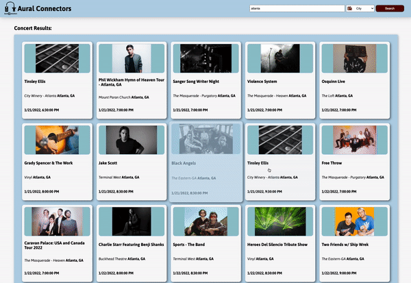

# aural_connectors
* **Purpose of the app:** 
   To allow users to find concerts near by.
* **How to use:**
   When you open the app, you can allow location access and concerts near you will automatically come up. You can also go to our search bar, select City, Venue, Genre or Artist and type in what you would like to find. Click the search button and you will be on your way to finding the perfect concert. Once you get to the search results and select a concert, you will find the details of the concert, a map that can give you directions to the venu, and resturants and hotels nearby. From the concert details page you can also click on the featured artists to find out more about their music. From the Artist page, you will find links to their soical media pages and all of their upcoming concerts.
* **Features on the app:**
The app is featured with unique designs and functionalities in each page including custom logos made by Jon. The contriubutors used Google Maps and Locations to provide directions to the venue and resutrants and hotels near by.

## Concerts Page in web browser:

## Concerts Page on mobile:

   
## Live link: 
https://aural-connectors.surge.sh/

## Featured programs: 
HTML, CSS, JavaScript

## External API:
Ticketmaster API, Google Maps API, and Google Places API

## This site was built by
[Jon Cundiff](https://github.com/jon-cundiff), [Phil Slater](https://github.com/Phil-Slater), [Katie Freeman](https://github.com/katie-freeman)
